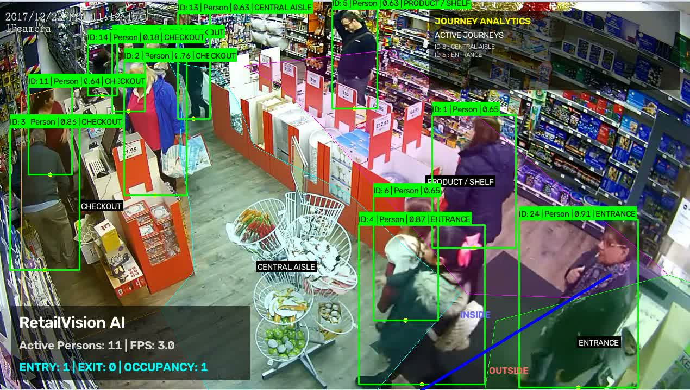
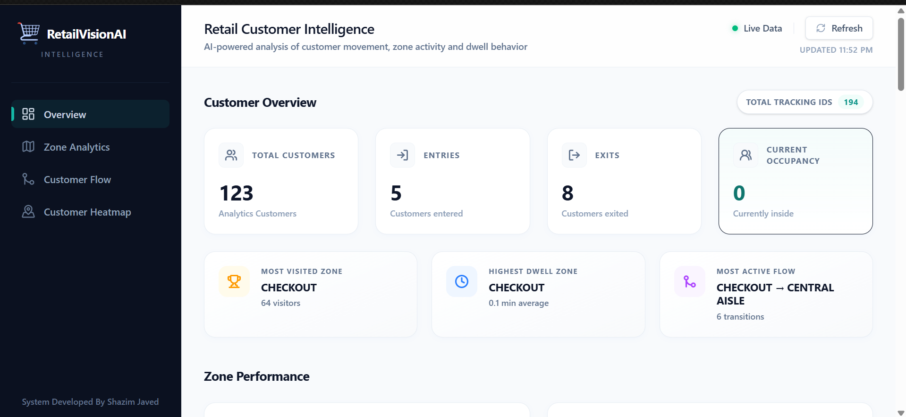
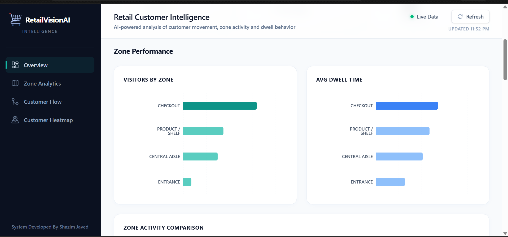
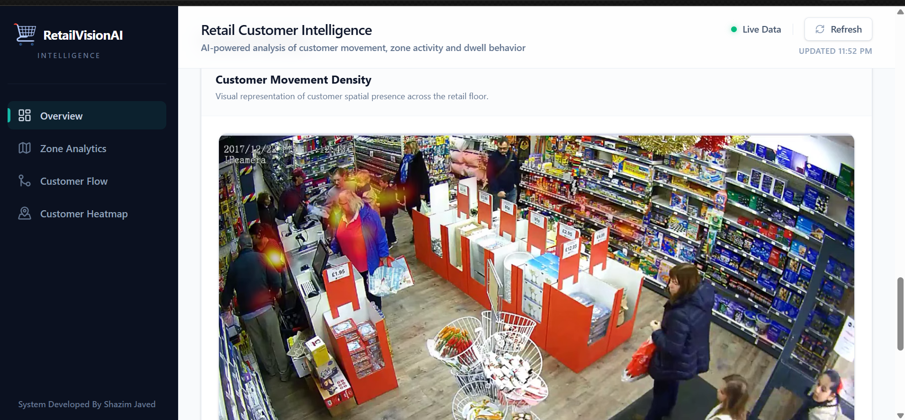
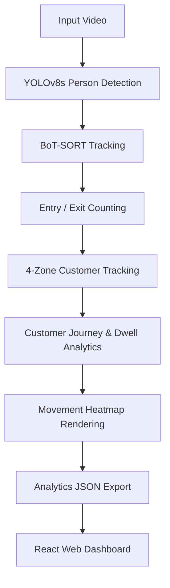

# 🛒 RetailVision AI
> Built by **Shazim Javed**

[](https://www.python.org/downloads/)
[](https://ultralytics.com)
[](https://opencv.org/)
[](https://reactjs.org/)
[](https://vitejs.dev/)
[](https://tailwindcss.com/)

RetailVision AI is a mature, production-ready computer-vision retail analytics system. It converts standard CCTV footage into actionable, real-time retail intelligence, offering comprehensive spatial and journey analytics without requiring specialized hardware.

---

## 📸 System Previews

<div align="center">
  
  
  
  
</div>

---

## ✨ Core Capabilities

RetailVision AI processes video footage to extract the following intelligence:

- 🎯 **Person Detection & Tracking**: Powered by Ultralytics YOLOv8s and BoT-SORT multi-object tracking.
- 🚪 **Entry & Exit Counting**: Accurately counts customers entering and leaving the field of view.
- 📊 **Store Occupancy**: Maintains a real-time tally of current store occupancy.
- 🏪 **Zone Analytics**: Tracks customer presence across 4 predefined retail zones.
- 🗺️ **Customer Journeys & Dwell Time**: Analyzes how long customers spend in each zone and maps their path through the store.
- 🌡️ **Movement Heatmaps**: Generates a spatial density heatmap showing the most highly trafficked areas.
- 💻 **Web Dashboard**: An interactive React/Vite/Tailwind dashboard to visualize the generated JSON analytics.

---

## 🚀 Quick Start

Execute the complete RetailVision AI pipeline with a single command:

```bash
# Activate your virtual environment first
.venv\Scripts\activate  # On Windows
source .venv/bin/activate # On Unix/MacOS

# Run the complete analysis pipeline
python main.py --source input/sample.mp4
```

### Outputs

The system will automatically process the video and generate the following artifacts in the `output/` directory:
- 📄 `analytics.json`: Complete customer journey and dwell-time analytics.
- 📄 `heatmap_analytics.json`: Spatial peak density coordinates and heatmap metadata.
- 🖼️ `customer_heatmap.png`: A high-resolution spatial heatmap visualization.
- 🎞️ `processed.mp4`: The final annotated video containing all visual layers (bounding boxes, trajectories, zones, active journey HUD).

---

## 📈 Dashboard Visualization

RetailVision AI includes a gorgeous, web-based presentation layer to consume and visualize the generated analytics.

To start the dashboard:
```bash
cd dashboard
npm install
npm run dev
```
Then, open the provided `localhost` URL in your browser. The dashboard will automatically read from the `output/` folder in the repository root.

---

## 🏗️ Architecture

The pipeline is designed to perform a single-pass extraction of all required computer vision metrics to maximize performance.



---

## 🧪 Engineering Notes & Experimental Research

RetailVision AI's production pipeline uses the frozen BoT-SORT baseline tracker without Re-ID. During development, a BoT-SORT + Re-ID experimental benchmark was conducted, which demonstrated that enabling Re-ID actually degraded tracking stability (higher ID switches) on our target retail CCTV angles. As such, Re-ID remains disabled in the production orchestration.

Unit testing infrastructure for the core analytics engines (counting, zones, heatmaps) can be found in the `tests/` directory. Run them via:
```bash
python -m unittest discover tests
```
