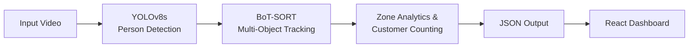

# 🛒 RetailVision AI


RetailVision AI is a computer vision portfolio project designed for retail store analytics. It leverages state-of-the-art object detection and tracking to analyze customer movement, dwell times, and zone activity from CCTV footage, presenting the insights through a beautiful, real-time web dashboard.

---

## 🏗️ Architecture



- **Detector:** `YOLOv8s` — Selected over YOLOv8n after benchmarking showed 22% higher person detection coverage (13.4 vs 11.0 avg detections/frame) with stronger confidence scores.
- **Tracker:** `BoT-SORT` (default Ultralytics config, ReID disabled) — Selected after controlled experiments against ByteTrack and BoT-SORT+ReID. It reduced tracking fragmentation by ~24% while preserving full detection coverage. Its camera motion compensation (`sparseOptFlow`) perfectly handles minor camera movement in retail footage.

> **Note:** Some identity fragmentation remains during extended occlusions and person crossings. This is expected behavior for an IoU-based tracker without dedicated re-identification.

---

## 🚀 Development Phases

### Phase 1: Video Ingestion & Person Detection
Reads a local video file, runs YOLOv8s for person detection, and outputs the processed video with bounding boxes, confidence scores, and person count per frame.

### Phase 2: Multi-Object Tracking
Integrates BoT-SORT to assign persistent tracking IDs to detected persons across video frames.

### Phase 3: Customer Counting
Implements an accurate segment-based counting line at the store entrance to track customer entries, exits, and current occupancy. Features include bounding-box bottom-center contact points, jitter filtering, and a 15-frame debounce for highly reliable physical counting.

### Phase 4: Zone & Journey Analytics
Stateful zone occupancy tracking and customer journey analytics, producing aggregate metrics like zone visits, dwell times, and flow transitions. (Exports to `analytics.json`).

### Phase 5: Web Dashboard
A professional React/Vite/Tailwind CSS frontend application that consumes the analytics data output by the Python pipeline to present a polished, real-time UI containing KPIs, zone performance charts, and customer flow visualizations.

### Phase 6: Customer Movement Heatmap
An isolated visual analytics experiment that consumes existing Phase 1-5 tracking coordinates to generate a spatial density heatmap representing where customers physically spend time. Uses Gaussian smoothing and a hot colormap to highlight high-traffic aisles.

---

## 💻 Setup Instructions

1. **Clone & Environment Setup:**
   ```bash
   python -m venv .venv
   .\.venv\Scripts\activate  # Windows
   pip install -r requirements.txt
   ```
2. **Add Data:**
   Place a test video in the `input/` directory (e.g., `input/sample.mp4`).

---

## 🛠️ Usage Pipeline

You can run the pipeline with progressive features enabled:

### 1. Detection Only
```bash
python main.py --source input/sample.mp4
```
*Output: `output/processed.mp4`*

### 2. Detection + Tracking
```bash
python main.py --source input/sample.mp4 --track
```
*Output: `output/tracking_result.mp4`*

### 3. Customer Counting
```bash
python main.py --source input/sample.mp4 --track --count
```
*Output: `output/counting_result.mp4`*

### 4. Zone Visualization & Debugging
```bash
python main.py --source input/sample.mp4 --track --count --zones --zone-debug --analytics-debug
```
*Output: `output/zones_result.mp4`*

### 5. Final Analytics Export
```bash
python main.py --source input/sample.mp4 --track --count --zones --analytics
```
*Output: Generates `output/analytics.json` containing the final processed retail metrics.*

### 6. Customer Movement Heatmap
```bash
python heatmap.py --source input/sample.mp4 --zones
```
*Output: `output/heatmap_result.mp4`, `output/customer_heatmap.png`, and `output/heatmap_analytics.json`*

---

## 📊 Web Dashboard

Once you have generated the `analytics.json` file, you can spin up the React dashboard to visualize the data:

```bash
cd dashboard
npm install
npm run dev
```

Open `http://localhost:5173` in your browser to view the RetailVision AI Dashboard.

---

## ⚙️ CLI Options

| Flag | Default | Description |
|------|---------|-------------|
| `--source` | — | Path to input video (required) |
| `--track` | off | Enable BoT-SORT multi-object tracking |
| `--count` | off | Enable entry/exit counting (Phase 3) |
| `--zones` | off | Enable zone visualization (Phase 4.1) |
| `--zone-debug` | off | Enable zone transitions/occupancy debug overlay (Phase 4.2) |
| `--analytics-debug` | off | Enable zone analytics debug overlay (Phase 4.3) |
| `--analytics` | off | Generate the final JSON payload for the dashboard (Phase 4.4) |
| `--model` | `yolov8s.pt` | YOLO model variant |
| `--output` | auto | Custom output path |
